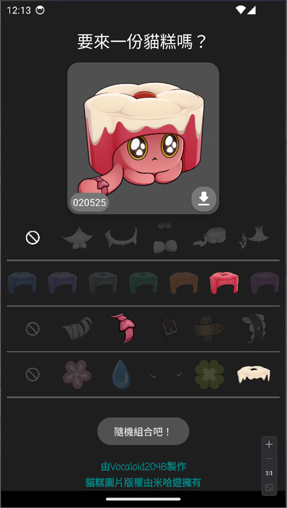

#  MaauGou - 一起來生成貓糕吧！

> 這是一個即興專案，可能之後會有不同更新？！

## App 簡介

### MaauGou 是 「貓 `maau1` 糕 `gou1`」 的廣東話讀音

靈感來自星穹鐵道 1.6 版本的「**異寵拾遺**」活動 
從玩完異寵拾遺活動之後，也有留意過網上的各種二創 
但好像沒有這類型的？所以就想試一下寫一個小品，也當作是語言轉換練手用 
同時也打算把它做進 [星穹觀星者 2](https://github.com/Coding-band/Honkai-Stargazer) 内，可以期待一下？

今天 (2024/02/11) 花了 3-4 小時寫 
從以前的 Java 代碼，轉到現在的 Kotlin 代碼 ~ 還是蠻順手的 
（前提是不用響應式介面 XD）

### # 貓糕圖片版權由米哈遊擁有，MaauGou 專案代碼由 Vocaloid2048 擁有

## App 特點

### 目前暫時還在施工 w，預計會推出貓糕生成紀錄 

### 還有其他建議嗎？來[這邊](https://discord.gg/uXatcbWKv2) `⚠問題發表-issues⚠` 跟我建議吧！

下面的每個選項都能選哦！ 
您也可以選擇按下「隨機組合吧！」的按鈕，讓 App 隨機幫你組合貓糕 
按下「下載」按鈕儲存貓糕圖~ 可以在系統相簿找到~ 

> 有 1%的機率會出現角色貓糕 

| 貓糕主頁                      | 使用示範                     |
| ----------------------------- | ---------------------------- |
|  |  |

### 關於 Coding Band

Coding Band 由 4 位核心成員組成,分別是 : 

- 《設計大佬》[2O48](https://github.com/2O48)
- 《RN 打嚕魚》[Dalufish](https://github.com/Dalufishe)
- 《禮貌貓咪》[夜芷冰](https://github.com/Vocaloid2048)
- 《Furina》[Somebody](https://github.com/ilikecatgirls)
